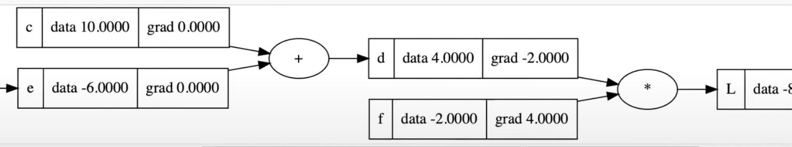
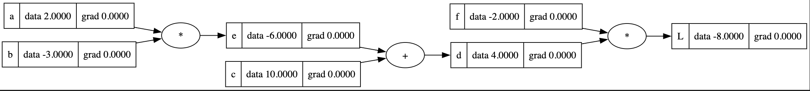

# Chain Rule

The chain rule, in simple terms, says that if you have a composite function $$f(g(x))$$ and want to take the derivative of it, you can do $$f'(g(x)) * g'(x)$$ . I.e. the derivative of the composite function is the inner function within the derivative of the outer function, multiplied by the derivative of the inner function.

## As it relates to [back propagation](../back-propagation/)

More simply, as we navigate through back propagation, we will want to identify how one node affects the loss function. But this node could be one of many.

In the above example, the local derivative of $$c \space w.r.t \space d$$ is 1, because it’s addition. But how does $$c$$ affect $$L$$? The [Chain Rule](https://en.wikipedia.org/wiki/Chain_rule) gives us this. And what it says is, using the above variable names

$$
\frac{dL}{dc} = \frac{dL}{dd} \cdot \frac{dd}{dc}
$$

Which in this case is $$-2 \cdot 1 = -2$$. It's even nicer because as we get further along the back propagation we only need to multiply the local derivative by the gradient of the grandparent node. Take the following:

If we want to do $$\frac{dL}{da}$$ we would only need to do $$\frac{de}{da} \cdot \frac{dd}{de}$$, since it's all multiplication we don't have to chain it all the way back to L.

Another cool thing here is that since the back propagation only relies on multiplying the local derivative with the grandparent derivative, the calculation can be arbitrarily complex. It doesn't have to be $$+$$ or $$*$$ between nodes, it can be anything as long as we can derive it. This is helpful when doing back propagation on a [neuron](../neuron) that has an activation function, so we can derive the value inclusive of the activation function.

## References

[https://www.khanacademy.org/math/ap-calculus-ab/ab-differentiation-2-new/ab-3-1a/a/chain-rule-review](https://www.khanacademy.org/math/ap-calculus-ab/ab-differentiation-2-new/ab-3-1a/a/chain-rule-review)
