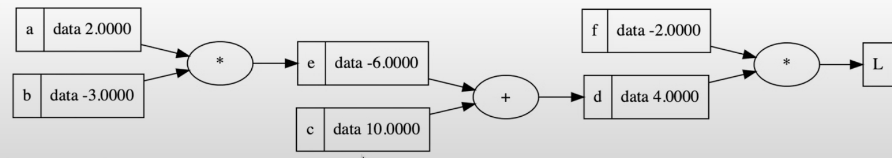
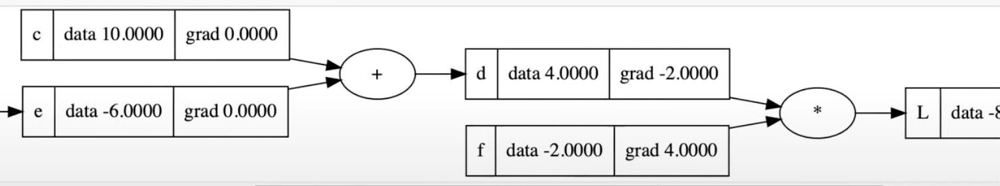

# Derivatives

The derivative of the function $$f(x)$$ is the slope at point $$x$$, or how much the value changes at that point when increasing x by tiny amounts. In more explicit terms, it’s the value of:

$$
f'(x) = \lim{h \to 0} \frac{f(x+h) - f(x)}{h}
$$

For the function $$3x^2 - 4x + 5$$ we can see that the following is true

```python
def f(x):
	return 3*x**2 - 4*x + 5

x = 3
h = 0.001
f(x)
# 20.0
f(x + h)
# 20.014003000000002
h = 0.0000001
# 20.00000140000003
```

So it’s increasing ever so slightly in the positive direction. To get the actual slope, we need to get the [rise over run](https://www.khanacademy.org/math/algebra/x2f8bb11595b61c86:linear-equations-graphs/x2f8bb11595b61c86:slope/a/slope-review).

```python
(f(x+h) - f(x)) / h
# 14.000000305713911
```

Which if we take the derivative of $$f(x)$$ where $$x = 3$$ we get $$f'(x) = 6x - 4 = 6*3 - 4 = 14$$ which matches our equations.

This is important, because as we start making complex chains of nodes (a neural net), we want to know the derivative of the output wrt the individual nodes. That way we can tell how we have to change that node to manipulate the output of the function.



This is a good example, where we would want to know the derivative of L wrt c, so we know how to change c to impact L.

## With respect to

I struggled a bit to understand/remember what derivatives of a variable w.r.t. a function/another variable _means_.

$$
d = a \cdot b + c
$$

$$
\frac{dd}{da} = b
$$

You would say this is “The derivative of $$d$$ (where d is the function) w.r.t. $$a$$. And what that means is whenever I change $$a$$, how does that change the output of $$d$$? Using the [Constant Multiple Rule](https://www.notion.so/Random-45efc6d468844b678dce1372e5eba950?pvs=21) we know that the derivative of a variable times a function is that variable times the derivative of the function.

$$
\frac{d}{dx}(k*f(x)) = k * \frac{d}{dx}(f(x))
$$

Why do we know that? Because some mathematician made it up. So in the above, $$k=b$$ and $$f(x) = a$$ which gives us $$f'(x) = a' = 1$$ which leaves us with $$b$$. So each time we increase $$a$$ by 1, $$d$$ increases by $$b$$.

Something important to think about is that in $$d$$ if we changed $$c$$ to $$c^2$$ the outcome is still the same. Because w.r.t $$a$$, $$c$$ is constant. Meaning changing $$a$$ has no impact on $$c$$. However if the equation was something like

$$
d = a \cdot b + a \cdot c^2
$$

We would then end up with a derivative of

$$
\frac{dd}{da} = b + 2c
$$

## Chain Rule

As we navigate through back propagation, we will want to identify how one node affects the loss function. But this node could be one of many.



In the above example, the local derivative of $$c \space w.r.t \space d$$ is 1, because it’s addition. But how does $$c$$ affect $$L$$? The [Chain Rule](https://en.wikipedia.org/wiki/Chain_rule) gives us this. And what it says is, using the above variable names

$$
\frac{dL}{dc} = \frac{dL}{dd} \cdot \frac{dd}{dc}
$$

Which in this case is $$-2 \cdot 1 = -2$$.
