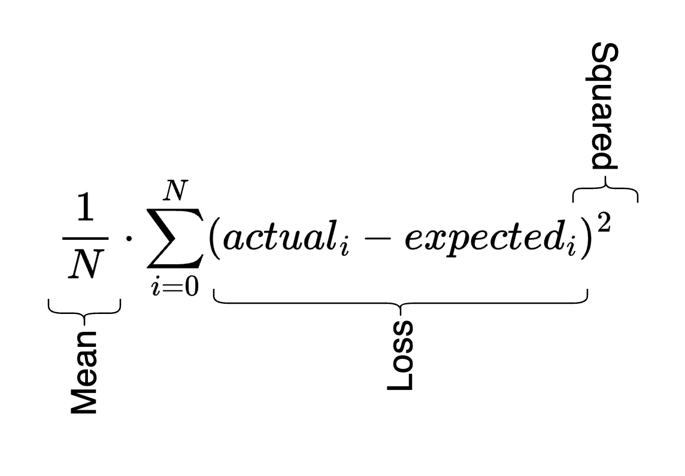

<h1><pre>
| ||
|| |_
</pre></h1>

The loss is a single number that helps us understand the performance of the neural network. The loss function is how we calculate that number. A lot of the time in training a neural network is spent optimizing this loss function.

## Mean-squared error loss

You calculate this by subtracting the actual output from the neural network with the expected output, squaring them, and then taking the mean of all values you tested. I _think_ this helps exaggerate values that are far from correct and shrink values that are closer to correct. But it also has the primary benefit of getting rid of the sign of the values, similar to $$abs$$.

The curious thing to me is that we don't actually take the mean of the summated squared losses, at least not in anything I've seen so far. So I'm hoping to figure that out. It seems like the division by $$N$$ doesn't really matter, it's the squaring of the loss values that actually give us our metrics. Everything else is just syntactic sugar.



## Example

If we use our [multi-layer perceptron](../multi-layer-perceptron/) we can provide it with our initial inputs `xs` and our expected outputs `ys` for 4 passes, feed those through the MLP, and then calculate the loss.

```python
n = MLP(3, [4, 4, 1])
xs = [
  [2.0, 3.0, -1.0],
  [3.0, -1.0, 0.5],
  [0.5, 1.0, 1.0],
  [1.0, 1.0, -1.0],
]
ys = [1.0, -1.0, -1.0, 1.0]
ypred = [n(x) for x in xs]

loss = sum((yout - ygt)**2 for ygt, yout in zip(ys, ypred))

# 7.817821598365237
```
