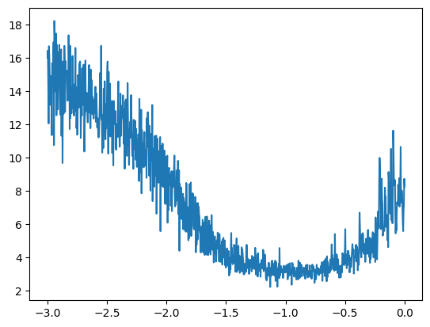

# Hyper parameters

Hyper parameters are the variables in your network that you get to control. Things like the embedding space of the inputs, the number of layers, the number of neurons in each layer, etc...

## Learning rate decay

One of these parameters is the learning rate, which is how much you multiply the gradient by on each pass to tune the weights to the loss function. An easy way to decide on this rate is to exponentially increase the learning rate, visualize it, and identify where it starts to blow up. The below shows us that $$10^{-1}$$ seems to be our best fit.

```python
import torch
import matplotlib.pyplot as plt
%matplotlib inline

lre = torch.linspace(-3, 0, 1000) # Generates 1000 steps between -3 and 0
lrs = 10**lre # Exponentiates the steps to go from 10^-3 to 10^0
lri = []
lossi = []

for i in range(1000):
    # Forward pass
    # Backwards pass
    lr = lri[i]
    p.data += -lr * p.grad

    loss = 1.0 # Calculate loss

    lri.append(lr)
    lossi.append(loss)

plt.plot(lri, lossi)

```


