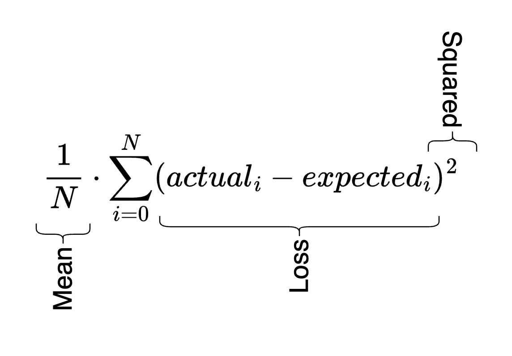

<h1><pre>
| ||
|| |_
</pre></h1>

The loss is a single number that helps us understand the performance of the neural network. The loss function is how we calculate that number. A lot of the time in training a neural network is spent optimizing this loss function.

It's important to understand [how the gradients of the neural network relate to the loss](../gradient-descent#how-gradients-relate-to-the-loss).

## Mean-squared error loss

You calculate this by subtracting the actual output of the neural network from the expected output, squaring them, and then taking the mean of all values you tested. I _think_ this helps exaggerate values that are far from correct and shrink values that are closer to correct. But it also has the primary benefit of getting rid of the sign of the values, similar to $$abs$$.

The curious thing to me is that we don't actually take the mean of the summated squared losses, at least not in anything I've seen so far. So I'm hoping to figure that out. It seems like the division by $$N$$ doesn't really matter, it's the squaring of the loss values that actually give us our metrics. Everything else is just syntactic sugar. This is a popular method when performing regression.



## Example

If we use our [multi-layer perceptron](../multi-layer-perceptron/) we can provide it with our initial inputs `xs` and our expected outputs `ys` for 4 passes, feed those through the MLP, and then calculate the loss.

```python
n = MLP(3, [4, 4, 1])
xs = [
  [2.0, 3.0, -1.0],
  [3.0, -1.0, 0.5],
  [0.5, 1.0, 1.0],
  [1.0, 1.0, -1.0],
]
ys = [1.0, -1.0, -1.0, 1.0]
ypred = [n(x) for x in xs]

loss = sum((yout - ygt)**2 for ygt, yout in zip(ys, ypred))

# 7.817821598365237
```

### Binary cross-entropy loss

TBD

## Max-margin loss

TBD

## Regularization

Not really familiar with this concept yet. But info is available [here](https://developers.google.com/machine-learning/crash-course/regularization-for-simplicity/l2-regularization). It seems to be a way to try and smooth out irregularities in your model. One example is taking all of your neurons squaring them, taking the mean, and then multiplying that value by a small number like .01. You then add that to your loss function and it helps the loss function force your weights to be zero. More on that [here](https://youtu.be/PaCmpygFfXo?si=oNApqfob8J9w3hhG&t=6817).

## Log likelihood

When looking at probabilities, we will commonly see they're between 0 and 1, which makes it hard to work with them since multiplying them creates increasingly smaller numbers. To counter this, we use the log likelihood by taking the log of the probability. Giving us a better range of numbers.

### Negative log likelihood

This is the exact same except we invert the values. This is so that we can use it as a loss function and commonly with loss functions we optimize to get them as low as possible. But for a normal log likelihood the extremely negative values mean it's less likely. Inverting fixes that. It's also common to average the negative log likelihood, to give us a better estimation across the data set. This is a popular method when performing classification.

I came back to this trying to remember the purpose of the negative here. An important thing to remember is that when we calculate NLL, we do so on the softmax (or equivalent) of the logits. Which means all values are fractions $$(0,1]$$ (not sure if 0 should instead be inclusive here). Which are always negative when logged. So we invert them to get a positive number.

### Cross-entropy loss

This is another name for log loss likelihood. PyTorch has a really nice [built-in method](../../frameworks/pytorch#cross-entropy) for this.

## Maximum Likelihood Estimation

This is when you train a model based purely on the statistical information you have access to, optimizing for likelihood of the various parameters.

## Overfitting

Overfitting is when you train the loss of your training set so much that it is too closely tied to that training set. Meaning the validation set will show much worse loss than the training set.

## Initialization

When first running your neural network, if you have an extremely high starting loss, it likely has to do with the weights and biases of your neurons. If they take up a wide range of numbers, that will result in a much greater variance in possible outcomes, increasing the loss function. If you instead start with biases set to 0 and weights multiplied by something like `.1`, you'll have a much smaller starting range. That more uniform distribution helps smooth out the loss.

I'm not sure how this applies to NNs with multiple layers and if you should apply this to the embeddings or not.

### Estimating

You can estimate what your starting loss should be by seeing what the loss would be for the uniform distribution of your data set. Assuming you have a character set of 27 characters, the expected loss would be:

```python
-torch.tensor(1/27).log()
# tensor(3.2958)
```

You can also do this with a negative log softmax

```python
enc = torch.ones(27)
print(-torch.softmax(enc, 0).log())
# tensor(3.2958)
```

Or cross_entropy

```python
enc = torch.ones(27)
hot = torch.zeros(27)
hot[0]=1
print(torch.nn.functional.cross_entropy(enc, hot))
# tensor(3.2958)
```
