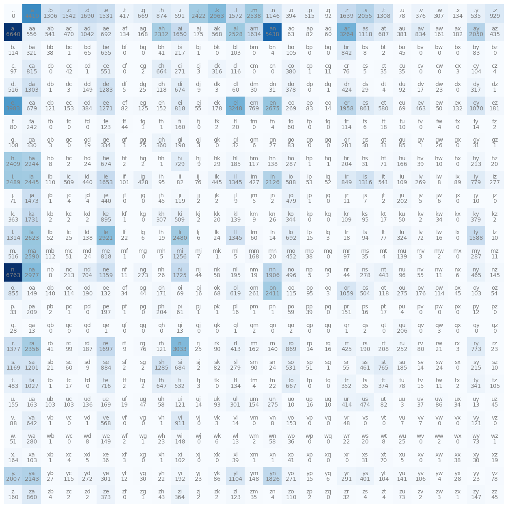
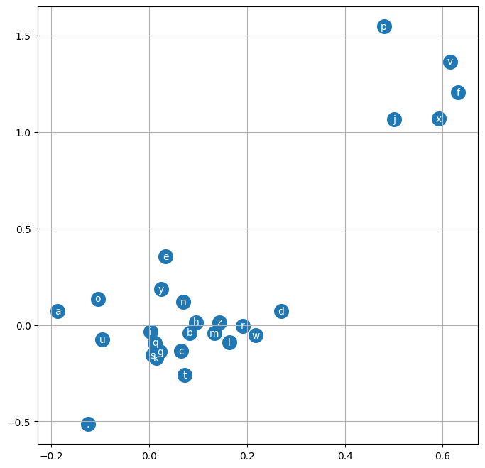

# Character-level Language Models

These models are able to predict the next character given a sequence of 1 or more previous characters. These are as opposed to [word-level language models](../word-level/).

## Bi-gram

Predicts the next character in the sequence exclusively based on the current character. We do this by taking all of the character pairs in every word in the data set and calculating how often the first character is succeeded by the second character. We can store this in a 2d array with the rows being the first character and the columns being the second. We'll also add an extra row for the [start and stop token](../index.md#start-and-stop-tokens).

A nice code-based representation of this is as follows:

```python
import torch
import matplotlib.pyplot as plt
%matplotlib inline

words = open('names.txt', 'r').read().splitlines()
TOKEN='.'

bigram = torch.zeros(27,27, dtype=torch.int32)

chars = list(set(''.join(words)+TOKEN))
chars.sort()
stoi = dict([(ch, i) for i, ch in enumerate(chars)])
itos = dict([(i, ch) for ch, i in stoi.items()])
for word in words:
    word = TOKEN+word+TOKEN
    for ch1, ch2 in zip(word, word[1:]):
        bigram[stoi.get(ch1), stoi.get(ch2)]+=1

plt.figure(figsize=(16,16))
plt.imshow(bigram, cmap='Blues')
for i in range(27):
    for j in range(27):
        chstr = itos[i] + itos[j]
        plt.text(j, i, chstr, ha="center", va="bottom", color='gray')
        plt.text(j, i, bigram[i, j].item(), ha="center", va="top", color='gray')
plt.axis('off')

g = torch.Generator().manual_seed(2147483647)
prob = (bigram+1).float() # +1 is smoothing the model, so there are no zeros that would result in an infinite negative log loss probability
prob /= prob.sum(1, keepdim=True)

for _ in range(10):
    char = 0
    out=''
    while True:
        char = torch.multinomial(prob[char], num_samples=1, replacement=True, generator=g).item()
        out += itos[char]
        if char == 0:
            break
    print(out)

# cexze.
# momasurailezitynn.
# konimittain.
# llayn.
# ka.
# da.
# staiyaubrtthrigotai.
# moliellavo.
# ke.
# teda.
```



We generate statistics for each character pairing, then sample from those statistics to create terrible names.

### Weights and biases

Since this isn't a neural network, there aren't weights and biases. However, there are still parameters. In this case, the likelihood of each character pairing is considered a parameter.

## Bi-gram converted to a single-layer neural network

If we take the bi-gram example we can easily expand off of it to create a neural network with one layer of inputs and one layer of outputs and get roughly the same result.

```python
import torch
words = open('names.txt', 'r').read().splitlines()
TOKEN='.'
chars = list(set(''.join(words)+TOKEN))
chars.sort()
stoi = dict([(ch, i) for i, ch in enumerate(chars)])
itos = dict([(i, ch) for ch, i in stoi.items()])
xs, ys = [], []
g = torch.Generator().manual_seed(2147483648)

for w in words:
  chs = [TOKEN] + list(w) + [TOKEN]
  for ch1, ch2 in zip(chs, chs[1:]):
    ix1 = stoi[ch1]
    ix2 = stoi[ch2]
    xs.append(ix1)
    ys.append(ix2)

xs = torch.tensor(xs)
ys = torch.tensor(ys)
W = torch.randn((27,27), generator=g, requires_grad=True)

xenc = torch.nn.functional.one_hot(xs, 27).float()


for _ in range(200):
  logits = xenc @ W
  counts = torch.exp(logits)
  probs = counts / counts.sum(1, keepdim=True)
  loss = (-probs[torch.arange(xs.nelement()), ys].log().mean())
  print(loss)
  W.grad = None
  loss.backward()
  W.data += -50 * W.grad
```

And then we can sample from this simple neural network with the following

```python
for _ in range(10):
  out = []
  ix = 0
  while True:
    xenc = torch.nn.functional.one_hot(torch.tensor([ix]), 27).float()
    logits = xenc @ W
    counts = logits.exp()
    p = counts / counts.sum(1, keepdims=True)

    ix = torch.multinomial(p, num_samples=1, replacement=True, generator=g).item()
    out.append(itos[ix])
    if ix == 0:
      break
  print(''.join(out))
```

### `xenc @ W`?!

It took me awhile to get my head around exactly what was happening when you do `logits = xenc @ W`. When we did this with the bigram earlier, we could just get the probabilities for each input by calling `prob[char]`. We can actually do that as well here if we really felt like it with `logits = W[ix][None, :]`, however as the math gets more complicated it's easier to stick to the matrix multiplication abstraction of that, which is `xenc @ W`. The `[None, :]` part takes care of converting the 27-length tensor to a `1x27` tensor.

## Tri-gram (quad-gram?) multi-layer perceptron

The hardest thing for me to grasp in this is the embedding space. In the following code, you'll see we have a hyper parameter called `EMBEDDING_SPACE` which is 2. This means that for every character `a-z.` in our input, that character lives in 2d space and can be plotted with an x,y axis. When visualizing this, the groupings of these characters represent how closely the neural network thinks they're related.



When we increase the embedding space, we're essentially giving the neural network more dimensions to tune to gauge similarity between the input characters. So it can relate them amongst a variety of commonalities.

```python
import torch
import torch.nn.functional as F
import matplotlib.pyplot as plt
%matplotlib inline

words = open('names.txt', 'r').read().splitlines()
g = torch.Generator().manual_seed(1)

[training_set, validation_set, test_set] = torch.utils.data.random_split(words, [.8 ,.1 ,.1], generator=g)

TOKEN='.'
CONTEXT_LENGTH=3
chars = list(set(''.join(words)+TOKEN))
chars.sort()
itos = dict([(i,s) for i, s in enumerate(chars)])
stoi = dict([s, i] for i, s in enumerate(chars))


def build_dataset(words):
    xs = []
    ys = []
    for word in words:
        context = [0]*CONTEXT_LENGTH
        for i, ch in enumerate(word+TOKEN):
            ix = stoi[ch]
            xs.append(context)
            ys.append(ix)

            # print(f"{''.join(itos[i] for i in context)} -> " + ch)
            context = context[1:]+[ix]
    return xs, ys

xs, ys = build_dataset(training_set)
xsVal, ysVal = build_dataset(validation_set)
xsTest, ysTest = build_dataset(test_set)

LAYER_NEURONS = 300
CHARACTERS = len(chars)
EMBEDDING_SPACE = 2
NUM_INPUTS = len(xs)
X = torch.tensor(xs)
Y = torch.tensor(ys)
X_VAL = torch.tensor(xsVal)
Y_VAL = torch.tensor(ysVal)
C = torch.randn((CHARACTERS, EMBEDDING_SPACE), generator=g)
INPUT_DIMENSIONS = CONTEXT_LENGTH * EMBEDDING_SPACE

W1 = torch.randn((INPUT_DIMENSIONS, LAYER_NEURONS), generator=g)
b1 = torch.randn(LAYER_NEURONS, generator=g)
W2 = torch.randn((LAYER_NEURONS, CHARACTERS), generator=g)
b2 = torch.randn(CHARACTERS, generator=g)
parameters = [W1, b1, W2, b2, C]
num_params = sum([p.nelement() for p in parameters])

print(f"{num_params=}")
for p in parameters:
    p.requires_grad = True

stepsi = []
lossi = []
BATCH_SIZE=32
for i in range(1000):
    ix = torch.randint(0, X.shape[0], (BATCH_SIZE,))

    # Forward pass
    emb = C[X[ix]] # No calculation is happening here, we're simply fetching the embeddings for each input
    h = torch.tanh(emb.view(-1, INPUT_DIMENSIONS) @ W1 + b1) # `.view` here transforms the NUM_INPUTS x CONTEXT_LENGTH x EMBEDDING_SPACE tensor into a NUM_INPUTS x (CONTEXT_LENGTH * EMBEDDING_SPACE) tensor so we can properly perform the dot product
    logits = h @ W2 + b2
    loss = F.cross_entropy(logits, torch.tensor(ys)[ix])

    # Backward pass
    for p in parameters:
        p.grad = None

    loss.backward()
    lr = .1
    for p in parameters:
        p.data += -lr * p.grad

    stepsi.append(i)
    lossi.append(loss.item())

# Calculate loss with our validation set
plt.plot(stepsi, lossi)
emb = C[X_VAL]
h = torch.tanh(emb.view(-1, INPUT_DIMENSIONS) @ W1 + b1)
logits = h @ W2 + b2
val_loss = F.cross_entropy(logits, Y_VAL)
print(f"train_loss={loss.item()}")
print(f"val_loss={val_loss.item()}")

# Sample from the model
for _ in range(10):
    out = []
    context = [0] * CONTEXT_LENGTH
    while True:
        emb = C[torch.tensor([context])]
        h = torch.tanh(emb.view(1, -1) @ W1 + b1)
        logits = h @ W2 + b2
        probs = torch.softmax(logits,1)
        ix = torch.multinomial(probs, num_samples=1, replacement=True, generator=g).item()
        context = context[1:]+[ix]
        if ix == 0:
            break
        out.append(itos[ix])
    print(''.join(out))
```
