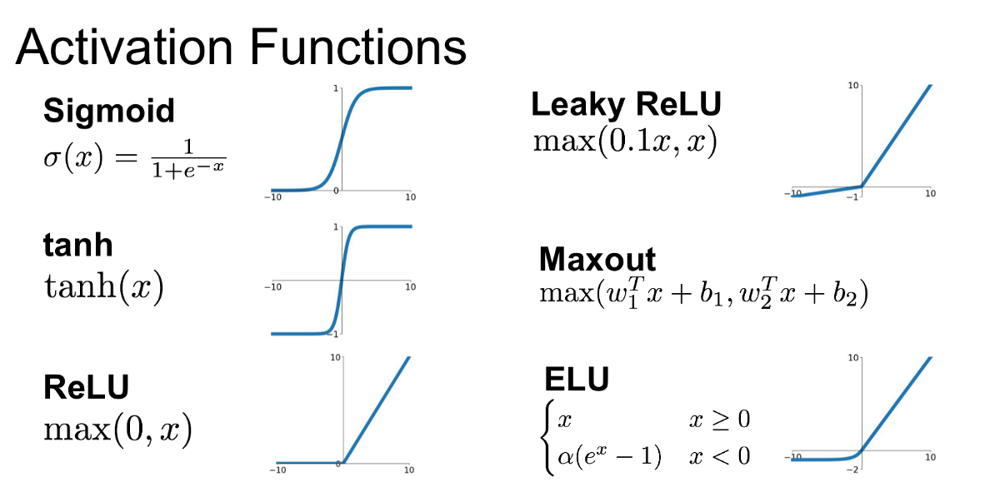

# Neuron

Neurons are exactly what they sound like, the things in our brain!


In machine learning, we model these in neural networks to simulate how the brain works. Neurons take in a series of values (x) and weights (w), which are individually multiplied and then added. The neuron fires by taking these and adding the bias of the neuron (how trigger happy it is) and passing it through an [activation function](#activation-functions) which helps squash the values to something like -1 to 1. This is usually `tanh` or a `sigmoid` function.

## Weights

The weights for each input of a neuron are arbitrarily chosen. There's probably a whole field of mathematics that goes into determining the best starting weights, but at this point for me, it's random. Then through the process of training, these weights get adjusted to try and fit our loss function.

### Logits

Usually when starting you'll choose random numbers as weights, these numbers can be either positive or negative. Because of this, we'll commonly get the exponent of the values by doing $$e^x$$. Then all negative numbers will be $$[0,1]$$ and all positive numbers will be $$(1,inf]$$. These are commonly referred to as [Logits](https://www.linkedin.com/posts/mwitiderrick_what-are-logits-in-deep-learning-logits-activity-7084819307959902209-UUGe/).

> Logits are the outputs of a neural network before the [activation function](#activation-functions) is applied. They are the unnormalized probabilities of the item belonging to a certain class.

In the case of our [bi-gram NN model](../model-types/character-level#bi-gram-converted-to-a-single-layer-neural-network) the logits represent for each input character, the probabilities of each output character in the set.

## Biases

Much like [weights](#weights), biases are also randomly chosen and updated throughout the training process to try and adjust the activation of that neuron to fit our loss function.

## Activation functions


Activation functions are called on the dot product of the weights and their inputs plus the bias of a neuron. This function helps us control the types of outputs we want to come from our neuron.

When using activation functions its important to look at how the weights of that neuron affect the activation function. For example if you're using $$tanh$$ which squashes your values to $$[-1,1]$$ and you have a lot of values $$>10$$ or $$<10$$ you'll have a lot of values that are $$-1$$ and $$1$$ which basically makes the neuron useless. You can [visualize this in PyTorch](../../frameworks/pytorch#visualize-activations) quite nicely as well.

Some further reading is available [here](https://arxiv.org/abs/1502.01852).

### Normalization

It's important to look at how you initialize the values for your neurons. You essentially want them to be gaussian at the beginning so everything has a fair chance of training. If you look at the following, already after one layer, our standard deviation has almost tripled after performing the dot product.

```python
g = torch.Generator().manual_seed(1)
x = torch.randn(1000, 10, generator=g)
w = torch.randn(10, 200, generator=g)
print(w)
y = x @ w
print(x.mean(), x.std())
# tensor(-0.0038) tensor(1.0057)

print(w.mean(), w.std())
# tensor(0.0003) tensor(1.0115)

print(y.mean(), y.std())
# tensor(-0.0064) tensor(3.2211)
```

To fix this, the referenced paper above ended up in the addition of the [kaiming_normal operation](https://pytorch.org/docs/stable/nn.init.html), which divides the weights by the square root of the number of inputs to each neuron. It's a bit different depending on exactly which non-linearity you're using. For simplicity though you can commonly divide your weights by the square root of the fan-in, or the number of inputs to your neuron.

```python
g = torch.Generator().manual_seed(1)
x = torch.randn(1000, 10, generator=g)
w = torch.randn(10, 200, generator=g) / 10**.5
print(w)
y = x @ w
print(x.mean(), x.std())
# tensor(-0.0038) tensor(1.0057)

print(w.mean(), w.std())
# tensor(9.0598e-05) tensor(0.3199)

print(y.mean(), y.std())
# tensor(-0.0020) tensor(1.0186)
```

Multiplying your weights by this changes the standard deviation because if you look at a layer with standard deviation 1 and multiply it by `.2` the standard deviation is now `.2`.

```python
g = torch.Generator().manual_seed(1)
w = torch.randn(10, 200, generator=g)
print(w.std())
# tensor(1.0293)

w = w * .2
print(w.std())
# tensor(0.2059)
```

So following that, we can set the standard deviation of a gaussian distribution by multiplying it by whatever our ideal distribution is. The kaiming documentation gives us the equation

$$
std = \frac{gain}{\sqrt{fan\_mode}}
$$

where gain is precalculated by them in the docs. For $$tanh$$ it is $$\frac{5}{3}$$. And `fan_mode` is the number of axons of the neuron. Applying this to our function

```python
g = torch.Generator().manual_seed(1)
w = torch.randn(10, 200, generator=g) * ((5/3)/10**.5)

print(w.std())
# tensor(.3084)
```

So we would want to multiply our initial weights of a neuron with 10 axons by `.3084` to have a more normal standard deviation after passing through the activation function.

### Batch normalization

A concept published in [this paper](https://arxiv.org/abs/1502.03167), provides a mechanism so that you don't have to normalize your weights at initialization but instead normalize them through the training cycle.

It's pretty complex and I don't fully understand it, but one critique of it is since it's working with the mean and standard deviation of each layer, it's coupling all of the inputs during training. So then independent inputs now have a dependency on each other and can affect training. What does that mean? I have no clue.

Another weird trait is that due to the way you calculate batch normalization, the biases actually ended up always equaling zero. So when doing batch normalization you don't use bias in your neurons.

### Softmax

A [softmax activation function](https://en.wikipedia.org/wiki/Softmax_function) is a mathematical expression that will take the outputs from a layer or a neural network and distributed them into probabilities, such that all the outputs sum to equal 1. This is an easy way to add probability distribution to the output of your net.

## Layers

Idk where to put this, but an interesting pattern was covered, which is during training each layer is commonly composed of 3 parts. A convolutional/weight part, a normalization part, and a non-linearity part.
