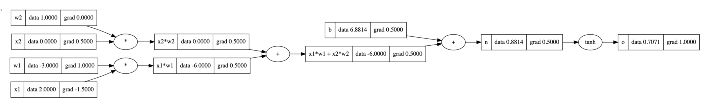

# 🥧🔥 PyTorch

If you read the word pytorch over and over, it really starts to lose it's meaning. Freaks me out when words do that. [PyTorch](https://pytorch.org/) is a production-grade machine learning framework written in Python that aids you in building and training neural networks.

Here's a simple tree showing the equation and back propagation we're doing, alongside the torch code to calculate the same.



```python
import torch
x1 = torch.Tensor([2.0]).double()                ; x1.requires_grad = True
x2 = torch.Tensor([0.0]).double()                ; x2.requires_grad = True
w1 = torch.Tensor([-3.0]).double()               ; w1.requires_grad = True
w2 = torch.Tensor([1.0]).double()                ; w2.requires_grad = True
b = torch.Tensor([6.8813735870195432]).double()  ; b.requires_grad = True
n = x1*w1 + x2*w2 + b
o = torch.tanh(n)

print(o.data.item())
o.backward()

print('---')
print('x2', x2.grad.item())
print('w2', w2.grad.item())
print('x1', x1.grad.item())
print('w1', w1.grad.item())

# 0.7071066904050358
# ---
# x2 0.5000001283844369
# w2 0.0
# x1 -1.5000003851533106
# w1 1.0000002567688737
```

You have to tell torch `x1.requires_grad = True` because they're leaf nodes and traditionally you don't want to calculate gradients for leaf nodes. My unconfirmed assumption, is because you usually aren't trying to change the inputs of the NN, you're trying to change the weights and biases of the [neurons](../../foundation/neuron/) inside of it.

## Tensors

Torch and other frameworks use the concept of a Tensor. A Tensor is an n-dimensional array of scalar values. This is done to take advantage of computer parallelism to speed up calculations.

### Tensor operations

Tensors, i.e. matricies, have a lot of easy built-in mathematics provided by pytorch. For example, if you have a [bi-gram model](../../foundation/model-types/character-level/#bi-gram) and want to get the probabilities of each character set in a specific row, you can do:

```python
p = bigram[0].float() # Converts all values in the first row to floats
p = p / p.sum() # Divides every cell in the row by the sum of the total row to get probabilities
```

## Generators

Generators in PyTorch allow you to enforce deterministic behavior by seeding the operations with a specific number. That way when they are run multiple times, they provide the same results.

```python
g = torch.Generator().manual_seed(1337)
p = torch.rand(3, generator=g)
```

## Multinomial

Allows you to extract values from a tensor based on the probabilities they represent. Given the tensor `[.00, .99, .01]` you would expect to get index `1` returned 99% of the time.

```python
g = torch.Generator().manual_seed(1337)
p = torch.rand(3, generator=g)
p = p / p.sum()
torch.multinomial(p, num_samples=10, replacement=True, generator=g)
```

## Broadcasting

When working with tensors, you will be doing a lot of math and to save you time when doing matrix operations, PyTorch will automatically [broadcast](https://pytorch.org/docs/stable/notes/broadcasting.html) for you if the conditions are right. This means if you try to divide a `27x27` tensor by a `27x1` tensor, it'll automatically convert the latter into a `27x27` tensor where the `1` dimension is now copied across the other 26. This is easy to manually verify as well.

```python
one = torch.Tensor([[1, 2],
                    [3, 4]]) # 2 rows x 2 columns
two = torch.Tensor([[1],
                    [2]]) # 2 rows x 1 column
out = one/two
print(out)
# tensor([[1.0000, 2.0000],
#         [1.5000, 2.0000]])

two = torch.Tensor([[1, 1],
                    [2, 2]]) # 2 rows x 2 columns. Manually broadcast the values from the first column into the second
out_two = one/two

print(out_two)
# tensor([[1.0000, 2.0000],
#         [1.5000, 2.0000]])

print(torch.equal(out, out_two))
# True
```

### `keepdim`

When using [`torch.sum`](https://pytorch.org/docs/stable/generated/torch.sum.html) there's a parameter called `keepdim`. What that does is makes sure that if you're summing across a set of rows, the output will have the dimension of those rows. Similarly, if you're summing across a bunch of columns, it will maintain that dimension. If you screw this up, when those values get broadcasted, they could get broadcasted in the wrong direction. E.g. broadcasting rows instead of the intended columns. In simpler terms, if you're using an `n x m`-dimensional array, and summing the `n` dimension, `keepdim=True` will output a `1 x m` tensor with sums for each n.

```python
val = torch.Tensor([[1, 2, 3],
                    [4, 5, 6]])
print(val.sum(0, keepdim=True)) # 1x3
# tensor([[5., 7., 9.]])
print(val.sum(1, keepdim=True)) # 2x1
# tensor([[ 6.],
#        [15.]])

print(val.sum(0, keepdim=False)) # 3
# tensor([5., 7., 9.])
print(val.sum(1, keepdim=False)) # 2
# tensor([ 6., 15.])
```

## One-hot encoding

[One-hot encoding](../../foundation/encoding/) can be used to transform your inputs into a format the neural network expects. PyTorch allows you to do this pretty easily.

```python
import torch.nn.functional as F
val = torch.tensor([0, 15, 4, 2, 4])
F.one_hot(val, num_classes=26)
# tensor([[1, 0, 0, 0, 0, 0, 0, 0, 0, 0, 0, 0, 0, 0, 0, 0, 0, 0, 0, 0, 0, 0, 0, 0, 0, 0],
#         [0, 0, 0, 0, 0, 0, 0, 0, 0, 0, 0, 0, 0, 0, 0, 1, 0, 0, 0, 0, 0, 0, 0, 0, 0, 0],
#         [0, 0, 0, 0, 1, 0, 0, 0, 0, 0, 0, 0, 0, 0, 0, 0, 0, 0, 0, 0, 0, 0, 0, 0, 0, 0],
#         [0, 0, 1, 0, 0, 0, 0, 0, 0, 0, 0, 0, 0, 0, 0, 0, 0, 0, 0, 0, 0, 0, 0, 0, 0, 0],
#         [0, 0, 0, 0, 1, 0, 0, 0, 0, 0, 0, 0, 0, 0, 0, 0, 0, 0, 0, 0, 0, 0, 0, 0, 0, 0]])
```

## Indexing tensors

When trying to get indices out of a tensor you can actually provide a list to the array accessor to get multiple items returned.

```python
C = torch.randn((27, 2))
C[5]
# tensor([-0.7773, -0.2515])

C[[1,2,3]]
# tensor([[-0.6540, -1.6095],
#         [-0.1002, -0.6092],
#         [-0.9798, -1.6091]])
```

You can also access multiple dimensions within a singular accessor

```python
C = torch.randn((27, 2))
C[5][1]
# tensor(-0.2515)

C[5,1]
# tensor(-0.2515)
```

## Unbind

There may be times where you want to take certain dimensions out of a tensor, you can do that using [unbind](https://pytorch.org/docs/stable/generated/torch.unbind.html)

```python
tens = torch.tensor([[1,2,3],[4,5,6],[7,8,9]])
print(tens)
print(torch.unbind(tens, 0))
# tensor([[1, 2, 3],
#         [4, 5, 6],
#         [7, 8, 9]])
# (tensor([1, 2, 3]), tensor([4, 5, 6]), tensor([7, 8, 9]))


print(torch.unbind(tens, 1))
# (tensor([1, 4, 7]), tensor([2, 5, 8]), tensor([3, 6, 9]))
```

What unbind does it takes in an arbitrary tensor and returns all values from it for the particular dimension you provide. In the above example you can see when we pass in dimension `1` it returns the tensor with all column values joined together.

## Cat

`torch.cat` will concatenate tensors, it's purely a transformational operation, there isn't any multiplication/summation/etc... happening.

```python
torch.cat(
    (
        torch.tensor([
            [1],
            [2]
        ]),
        torch.tensor([
            [3],
            [4]
        ])
    )
)

# tensor([[1],
#         [2],
#         [3],
#         [4]])
```

## View

Instead of needing [unbind](#unbind) and [cat](#cat), you can use the `view` function to transform the dimensions of a tensor.

```python
t = torch.arange(10)
print(t)
# tensor([0, 1, 2, 3, 4, 5, 6, 7, 8, 9])

t.view(2,5)
# tensor([[0, 1, 2, 3, 4],
#         [5, 6, 7, 8, 9]])
```

And this is extremely performant because the way PyTorch stores tensors `t.storage()` is as a single vector, so it only requires transformation at the runtime, not in the storage.

## Cross-entropy

When calculating the negative log loss likelihood we commonly do something like:

```python
ys = ...
logits = h @ W2 + b2
counts = logits.exp()
probs = counts / counts.sum(1, keepdims=True)
loss = (-probs[torch.arange(emb.shape[0]), ys].log().mean())
# tensor(12.4636)
```

PyTorch has this built-in with a simple [`cross_entropy`](https://pytorch.org/docs/stable/generated/torch.nn.functional.cross_entropy.html) function:

```python
torch.nn.functional.cross_entropy(logits, torch.tensor(ys))
# tensor(12.4636)
```

This function also handles edge cases far better. Because there is a limited range of numbers that computers can represent, if our logits contained `100`, running `.exp()` on that results in `inf`. And adding `inf` to any math really fucks things up. The `cross_entropy` function handles this by subtracting the logits by the largest number in them. Now the max value is 0, but the distributions are all still equal so the probabilities aren't changed at all.

## Visualize Activations

You can visualize the activations of neurons in a specific layer with the following.

```python
a = torch.randn((30,30))
plt.figure(figsize=(10,20))
plt.imshow(a.abs()>.99, cmap='gray', interpolation='nearest')
```


