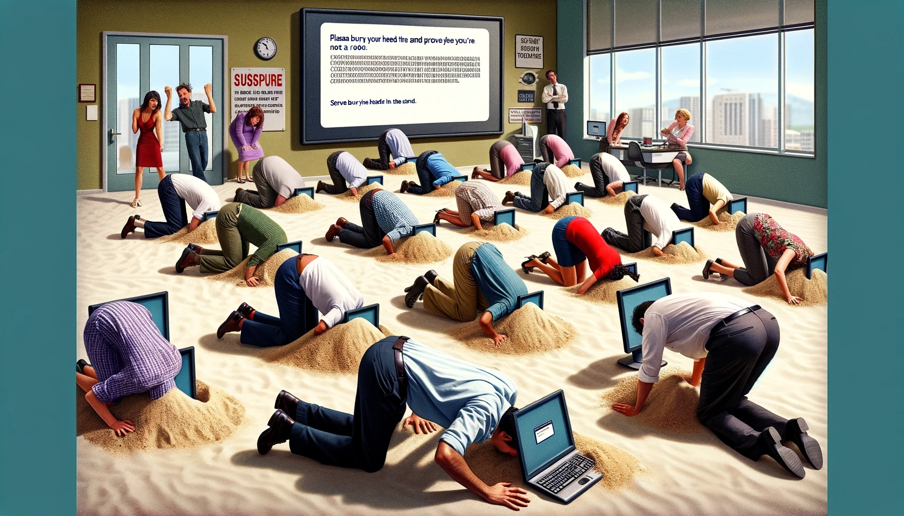
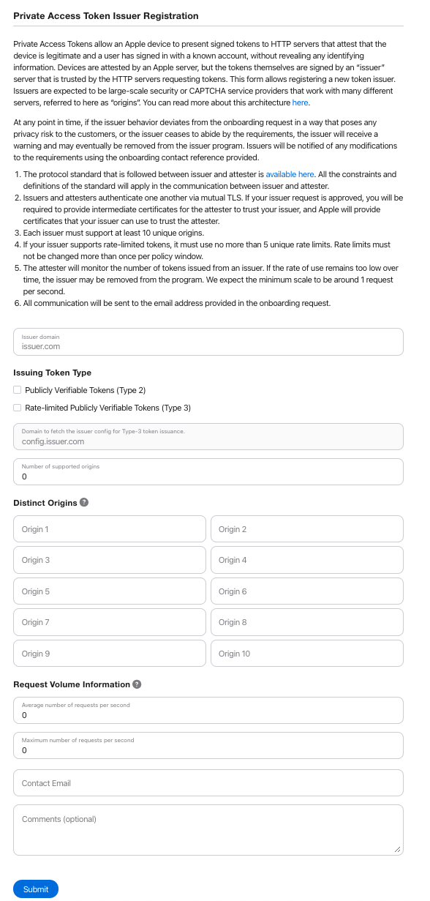

# 🍪 Cookie

Third-party cookies are starting to be [banned](https://developer.mozilla.org/en-US/blog/goodbye-third-party-cookies/) [in](https://sigmaos.com/tips/browsers/how-to-manage-cookies-on-brave-browser) [various](https://www.theverge.com/2020/3/24/21192830/apple-safari-intelligent-tracking-privacy-full-third-party-cookie-blocking) [browsers](https://developers.google.com/privacy-sandbox/blog/cookie-countdown-2024jan). This is a good thing because ads and the loss of privacy on the internet suck, but it also introduces new issues for cybersecurity. Primarily, being able to verify the authenticity of various users across websites.

## Please complete the captcha

<figure>

<figcaption>Thanks DALL-E</figcaption>
</figure>
Whenever Cloudflare makes you adopt a puppy to prove you're human it tags you with a cookie so everyone knows you're one of the good ones and they don't have to spam check you again for awhile. With the loss of these cookies that mechanism is becoming harder and harder to use. To solve this, various internet giants came up with the [Privacy Pass](https://datatracker.ietf.org/wg/privacypass/about) protocol for secure, anonymous token passing. With this protocol people like Cloudflare can now verify you're a human and issue you a set of tokens, that other websites can request. These tokens are fully(sorta) anonymous and websites can request them to verify you're not a robot, without disclosing who you are. I say sorta because Mozilla [has some issues](https://blog.mozilla.org/en/privacy-security/captcha-successor-privacy-pass-has-no-easy-answers-for-online-abuse/) with Privacy Pass and outlines them explicitly in their [research paper](https://docs.google.com/document/d/1k3QJG2D_Sq4zJiJRn9DfY80hEHuz9UWrJdTt8LbRsMM).

Issues aside, it's an emerging technology that has been adopted by huge providers, but has limited tooling available for it outside of those providers. You'll see various implementations of the protocol like Apple's [Private Access Tokens](https://developer.apple.com/news/?id=huqjyh7k) or Google's [Private State Tokens](https://developers.google.com/privacy-sandbox/protections/private-state-tokens). These implementations typically provide both major parts of the protocol by themselves: the Attester and the Issuer. The attester validates that you are human and the issuer issues you a set of tokens that can be exchanged with other websites to prove you've been attested. Interestingly enough, you can submit to Apple to become an Issuer as long as you fit some criteria.

  
Apple's PAT issuer requirements

  

And Google simply requires you to open an issue on their [Github repo](https://github.com/GoogleChrome/private-tokens).

## Show me the money

This is all pretty fancy, but what sort of business models does this expose for us? Can you monetize being an issuer, or sell some sort of product that helps companies implement these tokens? Becoming an attester seems lucrative, as there's a limited market for mature human verification these days. Commonly just [hcaptcha](https://www.hcaptcha.com/), [turnstile](https://www.cloudflare.com/products/turnstile/), or [recaptcha](https://www.google.com/recaptcha/about/). But there's a reason that's a hard market, it requires a lot of training data and AI is bypassing the shit out of most of these providers. Cloudflare [stopped providing captchas](https://blog.cloudflare.com/end-cloudflare-captcha) awhile ago, in favor of a more non-interactive mechanism. But you'll find [many](https://chromewebstore.google.com/detail/buster-captcha-solver-for/mpbjkejclgfgadiemmefgebjfooflfhl) [providers](https://oxylabs.io/) [bypassing](https://2captcha.com/) [captchas](https://www.capsolver.com/) [as](https://anti-captcha.com/) [a](https://brightdata.com/products/web-unlocker/captcha-solver) [service](https://nopecha.com/).

That's kind of where my research left it, I wasn't really sure there was a reasonable market of tooling to build around this ecosystem. Smarter people than I will figure something out, but for now I'm going to put this one on the shelf.
