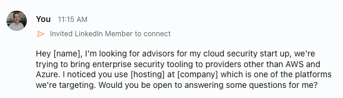

# ☁️ Cloud Security, or, mistysec 1.0

## WTF am I doing

When I resigned at my last job, I offered to stay on for six weeks to help ensure a smooth transition, since I was fortunate enough to have done a lot in my time there. During those six weeks, in between knowledge transfer sessions, I found myself stirring, trying to figure out what I wanted to build.

What were the problems I had identified in the world, that matched closely with my skill sets, and would also make me enough money to retire? It turns out basically nothing, or at least that's what it felt like. So rather than being original, I'd do what artists do best, imitate.

Cloud security has been exploding the last few years, wiz.io being the golden boy amongst us. Startup wisdom tells you that selling a shinier widget doesn't get you far, unless you love burning cash, and that you should have a differentiator, or something unique about you. A quick look at the top providers tells you that you aren't special, and there's not much that you can add that they don't already do. What does that leave?

My mind immediately goes to pricing, but that usually ends up in a race to the bottom. So if pricing is out, how else could I differentiate in the cloud security space? After looking around, I realized that every single CSPM covered exclusively:

- AWS
- Azure
- GCP
- IBM Cloud
- Alibaba Cloud

So those platforms are all covered, what does that leave?

## Fight for the little guys

I spend a lot of my time playing around with emerging technology platforms like [Render](https://render.com), [Supabase](https://supabase.co), and [Vercel](https://vercel.com). Like most new technologies, enterprise security tooling is not the first area of focus for them. They get their SOC 2 Type II and move on. But what are they providing for their users to ensure they are utilizing all of the configurations properly? For example, Render's default settings expose your database to the entire world. How many people do you think notice that?

So that's it then, be wiz.io for the little guys. Offer enterprise security tooling downstream to the platforms that don't have enough users to attract the big players yet. How do I begin? To avoid the trope of a technical guy building a product no one wants, user research seemed like the most reasonable place to start.

## Call me the NSA

One of the things that I have going for me is I use to be a hacker (I'd argue I still am, but would never win a CTF at this point). I want to find users of Render and Supabase and ask them about their cybersecurity needs. In cybersecurity, we call this Open Source Intelligence (OSINT) and luckily for me, man is there a lot of it for this use case. For someone to use Render or Supabase they have to update their DNS records and point their domains to ones owned by the cloud provider. I could go around scraping and abusing DNS all around the world, or I could just use our friends over at [host.io](https://host.io). You can look up a domain name or (Autonomous System Number)[https://www.cloudflare.com/learning/network-layer/what-is-an-autonomous-system/] (ASN) and see all domain names that point to it.

https://github.com/JacobReynolds/writing/assets/6618908/ecbd70ae-a92c-484a-b3d8-98031062b79c

After buying $500 worth of API tokens, I was able to start pulling all of these domain names down and prioritize who to reach out to. There were 27k domains, so how can I identify legitimate companies and not small blogging websites? In an ideal world, I'd use [zoominfo](https://zoominfo.com) but they don't really service companies of my size. Luckily for my, [Hubspot](https://hubspot.com) exists. I was able to sign up for their Starter Suite for only $240/year and get access to a pretty sweet set of tools. From there I imported all the domain names and hubspot automatically correlated the domain names to businesses, providing me their sector, revenue, employee count, and more. Unfortunately a lot of this data was pretty hit and miss, it would end up correlating small businesses on the platform to major providers. I doubt your local community center is doing $1,000,000,000 in revenue. I spent a good few days parsing through this data in a variety of ways.

After finding an eligible business, I would look it up on [LinkedIn Sales Navigator](https://business.linkedin.com/sales-solutions/sales-navigator) and reach out to the most senior technical leadership or founder with a message along the lines of:

Sales is a funky thing for me and I imagine most technical people. It can come off as pretty ingenuine and scammy. In most cases, it usually is, so that's a fair thought. Like most things though, I think if you're a good person, working with good people, everyone benefits. To me it felt weird sending hundreds of LI connections asking for advisors, but I routinely found that when I got on a call with someone they were kind and gracious and happy to help. I'm immensely grateful to the people that have taken me up on these offers in their various forms.

## `Text content does not match server-rendered HTML`

Like everyone's favorite React error, my thoughts and reality didn't exactly match up. Through my conversations I realized that the types of businesses that have $50k+ to spend on cybersecurity tooling are unfortunately not on Render or Supabase yet. At least not in any measurable capacity worth building a business around. I was pretty disappointed by this, I want to work with emerging companies that I find exciting and keep me engaged. But building a start up is all about this, hitting issues and finding solutions. And there's no one around to grade your homework, so you better be smart about it.

Side-note: this is a common thing you'll see in my writing and exploration. I've struggled to identify when a roadblock is a disqualifying event for a valid business, and when it's a normal challenge that you simply have to overcome to continue down the same path. In this case, I was pretty sure it was a disqualifying event.

## Swimming up stream

I realized I shot pretty far downstream from AWS to Supabase, so I look at who might be in the middle. It turns out there's a pretty mature middle market for cloud providers, comprised mainly of companies like [OVHCloud](https://us.ovhcloud.com/), [Vultr](https://www.vultr.com/), and [Hetzner](https://www.hetzner.com/). Wash, rinse, and repeat. I went to host.io (finally putting that $500 to work) and started pulling customers for these providers. Immediately, I'm motivated by seeing how much larger their client base is from the previous providers.

<figure class="small">

<figcaption>7 million OVHCloud domains</figcaption>
</figure>
And that was another week, scraping, triaging the information, reaching out on LinkedIn, and talking with customers of those platforms. Again, I was surprised that even at this level, aside from some whales, there didn't seem to be a large client base that would be spending enterprise dollars on security. I found a lot of wordpress hosting providers, game server hosting companies, the odd tech company, but no one I met with said that security was in their budget. I'm sure the people are out there, but I couldn't find them. Even now I'm doubting myself and thinking I should go back and keep trying to find those companies, but moving fast is important and I felt this was a big enough barrier to warrant moving on.

## Thanks for the fish

That's kind of where I left it. I didn't want to build a new shiny AWS widget and the differentiation I thought I could build around didn't exactly work out. However, I'm glad that I took the time to do market research, talk with customers, and validate the ideas. I could've spent 3 months building the platform and been SOL.

## For the nerds

A little postscript here, I did take a few days in this research to look at some technical options for building this platform. I wanted to explore some new programming languages/frameworks and see if any are suitable for easily building enterprise CRUD apps. The one that stood out to me most was [Laravel](https://laravel.com/) [Filament](https://filamentphp.com/). Ewwww, php, you're saying. I know, get over it. It was actually a really interesting set of tools that solve a shit load of problems. Filament is primarily built for internal tooling, not full SaaS apps but it can do quite a lot. At the end of the day though, I couldn't get over my issues with PHP (now you can say ewww). The hardcoding of strings to reference parameters all over the place, a barely existent type system, and just my general unfamiliarity with PHP made me ditch that route. Killer ecosystem though, check it out.
