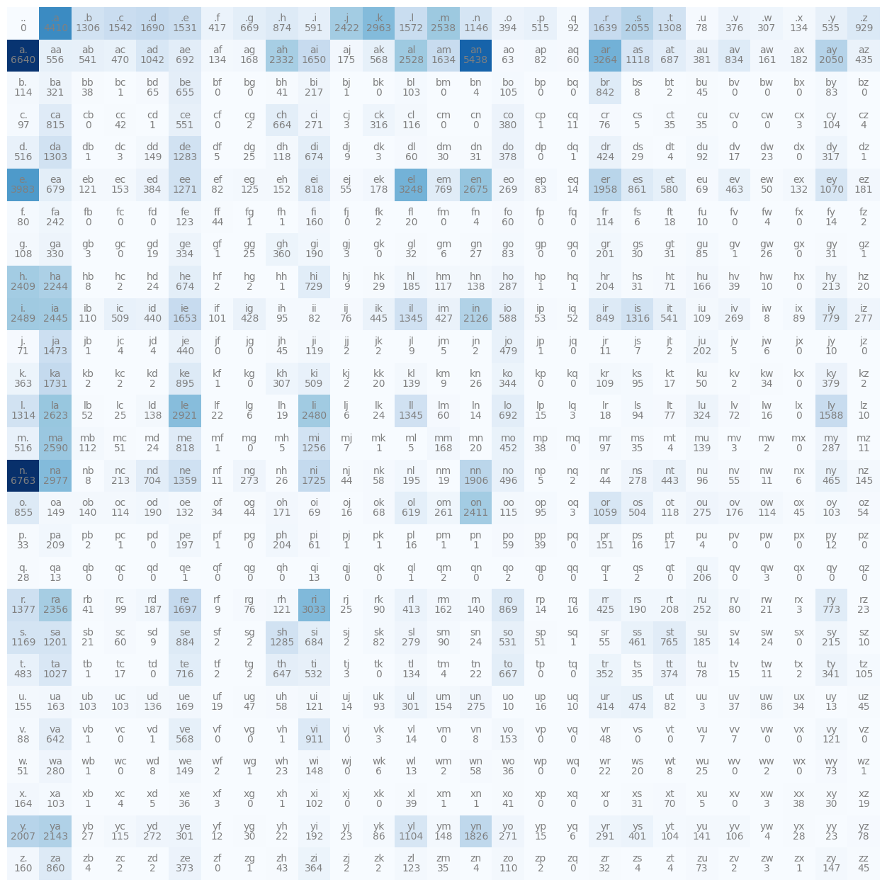

# bi-gram character-level language model

While not exactly a neural network, it's a good example to build off of and to reference as we build [multi-layer perceptrons](../multi-layer-perceptron/). These models are able to predict the next character given a sequence of 1 or more previous characters. These are as opposed to [word-level language models](../word-level/).

## Bi-gram

Predicts the next character in the sequence exclusively based on the current character. We do this by taking all of the character pairs in every word in the data set and calculating how often the first character is succeeded by the second character. We can store this in a 2d array with the rows being the first character and the columns being the second. We'll also add an extra row for the [start and stop token](../index.md#start-and-stop-tokens).

==- Code example

```python
import torch
import matplotlib.pyplot as plt
%matplotlib inline

words = open('names.txt', 'r').read().splitlines()
TOKEN='.'

bigram = torch.zeros(27,27, dtype=torch.int32)

chars = list(set(''.join(words)+TOKEN))
chars.sort()
stoi = dict([(ch, i) for i, ch in enumerate(chars)])
itos = dict([(i, ch) for ch, i in stoi.items()])
for word in words:
    word = TOKEN+word+TOKEN
    for ch1, ch2 in zip(word, word[1:]):
        bigram[stoi.get(ch1), stoi.get(ch2)]+=1

plt.figure(figsize=(16,16))
plt.imshow(bigram, cmap='Blues')
for i in range(27):
    for j in range(27):
        chstr = itos[i] + itos[j]
        plt.text(j, i, chstr, ha="center", va="bottom", color='gray')
        plt.text(j, i, bigram[i, j].item(), ha="center", va="top", color='gray')
plt.axis('off')

g = torch.Generator().manual_seed(2147483647)
prob = (bigram+1).float() # +1 is smoothing the model, so there are no zeros that would result in an infinite negative log loss probability
prob /= prob.sum(1, keepdim=True)

for _ in range(10):
    char = 0
    out=''
    while True:
        char = torch.multinomial(prob[char], num_samples=1, replacement=True, generator=g).item()
        out += itos[char]
        if char == 0:
            break
    print(out)

# cexze.
# momasurailezitynn.
# konimittain.
# llayn.
# ka.
# da.
# staiyaubrtthrigotai.
# moliellavo.
# ke.
# teda.
```

===

==- Bigram visualization

===
We generate statistics for each character pairing, then sample from those statistics to create terrible names.

### Weights and biases

Since this isn't a neural network, there aren't weights and biases. However, there are still parameters. In this case, the likelihood of each character pairing is considered a parameter.
