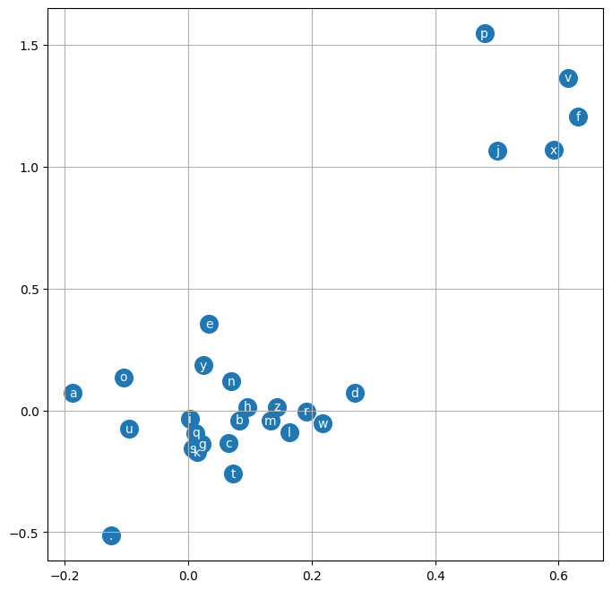

Multi-layer perceptrons are the beginnings of a neural network. They consist of multiple layers of [neurons](../../neurons), [normalization layers](../../neurons/normalization), and more to create a neural network. It's important to have a solid understanding of what a [neuron](../../neurons) is before diving in here.

Since I'm very code inclined, here's the python that implements the following image:


The following code also uses the `Value` class from [Back Propagation](../../back-propagation/)

```python
class Neuron:

  def __init__(self, nin):
    self.w = [Value(random.uniform(-1,1)) for _ in range(nin)]
    self.b = Value(random.uniform(-1,1))

  def __call__(self, x):
    # w * x + b
    act = sum((wi*xi for wi, xi in zip(self.w, x)), self.b)
    out = act.tanh()
    return out

  def parameters(self):
    return self.w + [self.b]

class Layer:

  def __init__(self, nin, nout):
    self.neurons = [Neuron(nin) for _ in range(nout)]

  def __call__(self, x):
    outs = [n(x) for n in self.neurons]
    return outs[0] if len(outs) == 1 else outs

  def parameters(self):
    return [p for neuron in self.neurons for p in neuron.parameters()]

class MLP:

  def __init__(self, nin, nouts):
    sz = [nin] + nouts
    self.layers = [Layer(sz[i], sz[i+1]) for i in range(len(nouts))]

  def __call__(self, x):
    for layer in self.layers:
      x = layer(x)
    return x

  def parameters(self):
    return [p for layer in self.layers for p in layer.parameters()]

x = [2.0, 3.0, -1.0]
n = MLP(3, [4, 4, 1])
n(x)
```

## single-layer perceptron

If we take the [bi-gram example](../bi-gram/) we can easily expand off of it to create a neural network with one layer of inputs and one layer of outputs and get roughly the same result.

==- Code example

```python
import torch
words = open('names.txt', 'r').read().splitlines()
TOKEN='.'
chars = list(set(''.join(words)+TOKEN))
chars.sort()
stoi = dict([(ch, i) for i, ch in enumerate(chars)])
itos = dict([(i, ch) for ch, i in stoi.items()])
xs, ys = [], []
g = torch.Generator().manual_seed(2147483648)

for w in words:
  chs = [TOKEN] + list(w) + [TOKEN]
  for ch1, ch2 in zip(chs, chs[1:]):
    ix1 = stoi[ch1]
    ix2 = stoi[ch2]
    xs.append(ix1)
    ys.append(ix2)

xs = torch.tensor(xs)
ys = torch.tensor(ys)
W = torch.randn((27,27), generator=g, requires_grad=True)

xenc = torch.nn.functional.one_hot(xs, 27).float()


for _ in range(200):
  logits = xenc @ W
  counts = torch.exp(logits)
  probs = counts / counts.sum(1, keepdim=True)
  loss = (-probs[torch.arange(xs.nelement()), ys].log().mean())
  print(loss)
  W.grad = None
  loss.backward()
  W.data += -50 * W.grad
```

===

And then we can sample from this simple neural network with the following

==- Code example

```python
for _ in range(10):
  out = []
  ix = 0
  while True:
    xenc = torch.nn.functional.one_hot(torch.tensor([ix]), 27).float()
    logits = xenc @ W
    counts = logits.exp()
    p = counts / counts.sum(1, keepdims=True)

    ix = torch.multinomial(p, num_samples=1, replacement=True, generator=g).item()
    out.append(itos[ix])
    if ix == 0:
      break
  print(''.join(out))
```

===

### `xenc @ W`?!

It took me awhile to get my head around exactly what was happening when you do `logits = xenc @ W`. When we did this with the bigram earlier, we could just get the probabilities for each input by calling `prob[char]`. We can actually do that as well here if we really felt like it with `logits = W[ix][None, :]`, however as the math gets more complicated it's easier to stick to the matrix multiplication abstraction of that, which is `xenc @ W`. The `[None, :]` part takes care of converting the 27-length tensor to a `1x27` tensor.

## multi-layer perceptron

A multi-layer perceptron builds off of the single-layer perceptron concept, but adds in the concepts of [activation functions](../../neurons/activation-functions), [normalization](../../neurons/normalization), and more.
The hardest thing for me to grasp in this is the embedding space. In the following code, you'll see we have a hyper parameter called `EMBEDDING_SPACE` which is 2. This means that for every character `a-z.` in our input, that character lives in 2d space and can be plotted with an x,y axis. When visualizing this, the groupings of these characters represent how closely the neural network thinks they're related.

==- Visualization of embeddings

===

When we increase the embedding space, we're essentially giving the neural network more dimensions to tune to gauge similarity between the input characters. So it can relate them amongst a variety of commonalities.

==- By-hand code example

```python
import torch
import torch.nn.functional as F
import matplotlib.pyplot as plt
%matplotlib inline

words = open('names.txt', 'r').read().splitlines()
g = torch.Generator().manual_seed(1)

[training_set, validation_set, test_set] = torch.utils.data.random_split(words, [.8 ,.1 ,.1], generator=g)

TOKEN='.'
CONTEXT_LENGTH=3
chars = list(set(''.join(words)+TOKEN))
chars.sort()
itos = dict([(i,s) for i, s in enumerate(chars)])
stoi = dict([s, i] for i, s in enumerate(chars))


def build_dataset(words):
    xs = []
    ys = []
    for word in words:
        context = [0]*CONTEXT_LENGTH
        for i, ch in enumerate(word+TOKEN):
            ix = stoi[ch]
            xs.append(context)
            ys.append(ix)

            # print(f"{''.join(itos[i] for i in context)} -> " + ch)
            context = context[1:]+[ix]
    return xs, ys

xs, ys = build_dataset(training_set)
xsVal, ysVal = build_dataset(validation_set)
xsTest, ysTest = build_dataset(test_set)

LAYER_NEURONS = 300
CHARACTERS = len(chars)
EMBEDDING_SPACE = 2
NUM_INPUTS = len(xs)
X = torch.tensor(xs)
Y = torch.tensor(ys)
X_VAL = torch.tensor(xsVal)
Y_VAL = torch.tensor(ysVal)
C = torch.randn((CHARACTERS, EMBEDDING_SPACE), generator=g)
INPUT_DIMENSIONS = CONTEXT_LENGTH * EMBEDDING_SPACE

W1 = torch.randn((INPUT_DIMENSIONS, LAYER_NEURONS), generator=g)
b1 = torch.randn(LAYER_NEURONS, generator=g)
W2 = torch.randn((LAYER_NEURONS, CHARACTERS), generator=g)
b2 = torch.randn(CHARACTERS, generator=g)
parameters = [W1, b1, W2, b2, C]
num_params = sum([p.nelement() for p in parameters])

print(f"{num_params=}")
for p in parameters:
    p.requires_grad = True

stepsi = []
lossi = []
BATCH_SIZE=32
for i in range(1000):
    ix = torch.randint(0, X.shape[0], (BATCH_SIZE,))

    # Forward pass
    emb = C[X[ix]] # No calculation is happening here, we're simply fetching the embeddings for each input
    h = torch.tanh(emb.view(-1, INPUT_DIMENSIONS) @ W1 + b1) # `.view` here transforms the NUM_INPUTS x CONTEXT_LENGTH x EMBEDDING_SPACE tensor into a NUM_INPUTS x (CONTEXT_LENGTH * EMBEDDING_SPACE) tensor so we can properly perform the dot product
    logits = h @ W2 + b2
    loss = F.cross_entropy(logits, torch.tensor(ys)[ix])

    # Backward pass
    for p in parameters:
        p.grad = None

    loss.backward()
    lr = .1
    for p in parameters:
        p.data += -lr * p.grad

    stepsi.append(i)
    lossi.append(loss.item())

# Calculate loss with our validation set
plt.plot(stepsi, lossi)
emb = C[X_VAL]
h = torch.tanh(emb.view(-1, INPUT_DIMENSIONS) @ W1 + b1)
logits = h @ W2 + b2
val_loss = F.cross_entropy(logits, Y_VAL)
print(f"train_loss={loss.item()}")
print(f"val_loss={val_loss.item()}")

# Sample from the model
for _ in range(10):
    out = []
    context = [0] * CONTEXT_LENGTH
    while True:
        emb = C[torch.tensor([context])]
        h = torch.tanh(emb.view(1, -1) @ W1 + b1)
        logits = h @ W2 + b2
        probs = torch.softmax(logits,1)
        ix = torch.multinomial(probs, num_samples=1, replacement=True, generator=g).item()
        context = context[1:]+[ix]
        if ix == 0:
            break
        out.append(itos[ix])
    print(''.join(out))
```

===

==- Pytorch code example

```python
import torch
import matplotlib.pyplot as plt
%matplotlib inline

torch.manual_seed(101)

words = open('names.txt', 'r').read().splitlines()
[training_set, validation_set, test_set] = torch.utils.data.random_split(words, [.8 ,.1 ,.1])

TOKEN='.'
chars = list(set(''.join(words)+TOKEN))
chars.sort()
itos = dict([(i,s) for i, s in enumerate(chars)])
stoi = dict([s, i] for i, s in enumerate(chars))
vocab_size = len(chars)
block_size = 8

def build_dataset(words):
    xs = []
    ys = []
    for word in words:
        context = [0]*block_size
        for i, ch in enumerate(word+TOKEN):
            ix = stoi[ch]
            xs.append(context)
            ys.append(ix)

            # print(f"{''.join(itos[i] for i in context)} -> " + ch)
            context = context[1:]+[ix]
    return torch.tensor(xs), torch.tensor(ys)

Xtr, Ytr = build_dataset(training_set)
Xval, Yval = build_dataset(validation_set)
Xtest, YTest = build_dataset(test_set)

n_embd = 10
n_hidden = 200

model = torch.nn.Sequential(
    torch.nn.Embedding(vocab_size, n_embd),
    torch.nn.Flatten(),
    torch.nn.Linear(n_embd * block_size, n_hidden, bias=False), torch.nn.BatchNorm1d(n_hidden), torch.nn.Tanh(),
    torch.nn.Linear(n_hidden, n_hidden, bias=False), torch.nn.BatchNorm1d(n_hidden), torch.nn.Tanh(),
    torch.nn.Linear(n_hidden, n_hidden, bias=False), torch.nn.BatchNorm1d(n_hidden), torch.nn.Tanh(),
    torch.nn.Linear(n_hidden, n_hidden, bias=False), torch.nn.BatchNorm1d(n_hidden), torch.nn.Tanh(),
    torch.nn.Linear(n_hidden, n_hidden, bias=False), torch.nn.BatchNorm1d(n_hidden), torch.nn.Tanh(),
    torch.nn.Linear(n_hidden, n_hidden, bias=False), torch.nn.BatchNorm1d(n_hidden), torch.nn.Tanh(),
    torch.nn.Linear(n_hidden, vocab_size)
)

with torch.no_grad():
    model[-1].weight *= 0.1

print(sum(p.nelement() for p in model.parameters()))
# 224097

parameters = model.parameters()
for p in parameters:
  p.requires_grad = True

max_steps = 50000
batch_size = 32
for i in range(max_steps):
    ix = torch.randint(0, Xtr.shape[0], (batch_size, ))
    Xb, Yb = Xtr[ix], Ytr[ix]
    # forward pass
    x = model(Xb)
    loss = torch.nn.functional.cross_entropy(x, Yb)

    for p in model.parameters():
        p.grad = None
    loss.backward()

    lr = 0.1 if i<(max_steps*.75) else .01
    for p in model.parameters():
        p.data += -lr * p.grad

    if i%(max_steps/10) == 0:
        print(f"{i:7d}/{max_steps:7d}: loss={loss.item(): .4f}")

#       0/  50000: loss= 3.2879
#    5000/  50000: loss= 2.2665
#   10000/  50000: loss= 1.8019
#   15000/  50000: loss= 2.3069
#   20000/  50000: loss= 1.9199
#   25000/  50000: loss= 2.1590
#   30000/  50000: loss= 1.8411
#   35000/  50000: loss= 2.1169
#   40000/  50000: loss= 1.9671
#   45000/  50000: loss= 1.7272

# Enable evaluation mode
model.eval()

# evaluate the loss
@torch.no_grad() # this decorator disables gradient tracking inside pytorch
def split_loss(split):
  x,y = {
    'train': (Xtr, Ytr),
    'val': (Xval, Yval),
    'test': (Xtest, Ytest),
  }[split]
  logits = model(x)
  loss = torch.nn.functional.cross_entropy(logits, y)
  print(split, loss.item())

split_loss('train')
split_loss('val')
split_loss('test')

# train 1.9532647132873535
# val 2.0290515422821045
# test 2.030517816543579

num_examples = 10
for _ in range(num_examples):
    CONTEXT = [0] * block_size
    out = []
    while True:
        logits = model(torch.tensor([CONTEXT]))
        probs = torch.softmax(logits, 1)
        ix = torch.multinomial(probs, num_samples=1, replacement=True).item()
        if ix == 0:
            break
        CONTEXT = CONTEXT[1:] + [ix]
        out.append(ix)
    print(''.join([itos[c] for c in out]))

# reemaria
# angeliel
# nyta
# torniss
# kaalyn
# celina
# sadari
# malayna
# gerykus
# aarisha
```

===

### Critiques

One critique of MLPs is that the first step in the network crushes all of the data right off the bat, since all of the input embeddings are fed into a single layer. It might be better to work on smaller groupings of characters in multiple layers, so that they may more intelligently come up with relationships. More on that in [wavenet](../wavenet) An example of that is at the beginning of this article, and another example of that crushing can be seen below.

