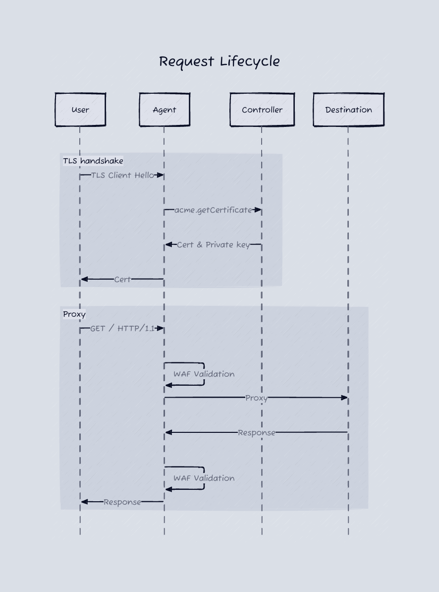

# 🛜 CDN

Not exactly a CDN, more of a WAAP, but anytime I say WAAP people starting singing Cardi B lyrics at me. WAAP stands for Web Application and API Protection. The common example would be [Cloudflare](https://www.cloudflare.com/), but more closely would be [Imperva](https://www.imperva.com/) and [Akamai](https://www.akamai.com/). These platforms proxy all of your traffic and perform DDOS protection, bot mitigation, web firewall rule matching, API inventorying, and more. Similar in grandiose size to [a bank](../bank/), but far more in my wheelhouse. At this point I'm about 4 weeks into my start up journey and am getting a bit sick of cold outreach on LinkedIn, so I decided to grace myself with a little technical research. I knew there was a market for this, I wasn't quite sure what my differentiator would be, but I wanted to see if I could get the basic concepts built first to recharge my batteries a bit.

To give you an introduction to what I built, these two diagrams can be pretty helpful and are explained below.

==- Infrastructure Diagram

==- WAF Request Lifecycle

===

## Cheap AF

So an edge network that can intercept traffic across the globe, cache it, inspect it, or whatever it, and then forward it to the destination server. That means aside from compute, our largest cost is likely going to be [network egress fees](https://getdeploying.com/reference/data-egress), and as that link shows, it's not cheap. If you're looking at using AWS, your egress costs are 9.2x what they'd be on something like Digital Ocean. From the good ol' days when I was building a [cloud security](../cloud-security/) company, I remembered Hetzner and OVHcloud, and their pricing seemed great for egress. After further inspection though they don't have a very large global presence. Hetzner is mostly central Europe and OVHcloud had a lot of locations but [limited support](https://us.ovhcloud.com/public-cloud/regions-availability/) for various features of their platform (like cheap computing plans) across those regions.

After some bouncing around, Digital Ocean (DO) seemed to be the best contender. I'd used it in the past, they have cute marketing, and had a good blend between global coverage and cheap egress fees.

## Can you hear me now?

The next hurdle was to try and build a network of servers around the world that could communicate with each other and proxy traffic. My brain immediately goes to Kubernetes (k8s). I use to manage a cluster in my last job, which thankfully we migrated off of, and am somewhat familiar with it. (Spoiler alert: he wasn't familiar enough with it). There are a lot of options for managing k8s:

- you can [raw dog it](https://kubernetes.io/docs/setup/production-environment/) by yourself
- use a managed service like [EKS](https://aws.amazon.com/eks/) or [GKE](https://cloud.google.com/Kubernetes-engine?hl=en)
- use some of the enterprise managers like [Rancher](https://www.rancher.com/)

There are also some fun options like [k3s](https://k3s.io/) and its variants that give you a simplified method to install k8s. I took a brief look at [Nomad](https://www.nomadproject.io/) but the ecosystem sadly isn't robust enough for me to feel comfortable adopting it, but they do have [multi-region federation](https://developer.hashicorp.com/nomad/tutorials/manage-clusters/federation) which is more than I can say for k8s, whose federation seems to be [eternally in beta](https://groups.google.com/g/kubernetes-sig-multicluster/c/lciAVj-_ShE).

It turns out, choosing k8s despite not having multi-region federation was going to be a problem. Follow along with my stupidity that wasted 2 days. I decided not to use Digital Ocean's managed k8s because it only supports deploying the cluster in a single region (hmmm...I wonder why they do that...). So I opted to use [Rancher Kubernetes Engine 2](https://docs.rke2.io/) (RKE2) since I could control how to deploy the nodes. I spun up worker nodes in DO's New York City (NYC), Amsterdam (AMS), and Sydney (SYD) regions and deployed a simple http server into them.

### How about now?

Cool, so I have a k8s cluster running across multiple regions, but now I need to figure out how to route traffic to different regions based on geographic location. You have 2 options when doing this, one is lease a /24 IPV4 range, bring it to a cloud provider, and broadcast it via BGP Anycast on nodes around the world (something DO doesn't support, btw...). You can see a good overview of Anycast [here](https://www.imperva.com/blog/how-anycast-works/) if you're interested. The other option is using [GeoDNS](https://docs.aws.amazon.com/Route53/latest/DeveloperGuide/routing-policy-geo.html) which lets you serve different DNS records based on the location of the user, or their proximity to your servers. That seems way simpler, albeit less robust. I threw in some records and pointed them at my hosts.

### ...now?

Finally, I can try and see if they can hear me. I send a request on my test network to https://dev.mistysec.com and.................timeout. What the fuck, dude?! I actually don't know why it took me this long to get around to testing the web server, but I wanted to get over the DNS hurdle and didn't expect an issue here at all. I'll save you the day of debugging I did and cut to the end, basically k8s isn't built to have its nodes geographically dispersed. Even if I send an HTTP request directly to an ingress node in NYC, it will still sometimes communicate with the node in AMS to see if it can handle the request. And occasionally, it'll also route the request over there. They don't really make any promises, or give you any (easy) controls, for routing traffic based on geolocation. And the options they do give you don't remove the latency at the control plane.

## Switching to Mint Mobile

Well that sucks. One thing that has always bothered me about k8s is that it's got a ton going on inside of it, a lot I don't know about, and definitely don't know how to fix. So I tried to strip my requirements down to the bare minimum and see if I could build what I needed from scratch. I would need:

- [ ] A service mesh, so the servers can communicate with each other. For example, to retrieve the SSL/TLS cert for a host to decrypt its traffic
- [ ] The ability to push containers to edge nodes and routinely update them
- [ ] A private network for this communication to happen across

## What the fuck is a kilometer?

Okay, so, a service mesh? I could probably drop this phrase in a conversation in silicon valley and get away with it, but I really had no idea what it was. Still don't. But at my base understanding, it's a way for a group of servers to discover and communicate with each other. [Istio](https://istio.io/latest/about/service-mesh/) is a popular example for how this is handled in k8s. I spent awhile researching, and wish I remembered all the weird things I looked at, but at the end of the day I ran into [NATS](https://nats.io/) which is a streaming and message passing platform (and also a lot more). Think Kafka, but sexier. This means I could have a NATS server in each region of my cluster, and then the edge nodes only need to connect to their local server. From there, they communicate with other servers via message subjects, e.g. `acme.getCertificate`, instead of needing to know their IP/Domain name. The servers then form a [regional cluster](https://docs.nats.io/running-a-nats-service/configuration/clustering) and a global [super-cluster](https://docs.nats.io/running-a-nats-service/configuration/gateways) and handle passing messages across the architecture. Long story short this means aside from the NATS servers, all my other servers only need to communicate with hosts in their region. And the NATS servers handle cross-region communication and private networking. Side note: they have a sweet piece of tech called [nex](https://nats.io/blog/introducing_nex/) coming out, that I wanted to use for my distributed containers here, but it was a bit too early in their alpha for my uses.

Alright, so all the servers can communicate, but it doesn't seem great to have them doing that over the public internet? NATS seems secure, but you really shouldn't be publicly exposing these ports.

!!! A note from the editor
Now, I know, at this point you're saying: "Jake who fucking cares if it's secure? You have no customers". And to that I would say...touché
!!!

## En Garde

In some cases, your service mesh will also handle securing your communication, and honestly one could argue using NATS with TLS would be secure enough as well, but what if I also want to do non-NATS things on this network? I looked at a couple commercial options, like [Tailscale](https://tailscale.com/), but didn't find any that you could deploy entirely yourself. I didn't want to use Digital Ocean VPCs because if this thing grows I'll likely move it to bare metal hosting with another provider and don't want to rewrite the networking. I ended up going with [Wireguard](https://www.wireguard.com/) for a couple reasons:

- It supports peer-to-peer connections, so I don't need a massive global network
- There is a [user-space golang library](https://github.com/WireGuard/wireguard-go) (I wouldn't know this until later...)
- Fully open-source and easy to deploy on-prem

## A brief aside

Something I haven't mentioned yet is how I'm handling all this infrastructure. In simple terms, I'm using [Pulumi](https://www.pulumi.com/) with [Remote Commands](https://www.pulumi.com/registry/packages/command/api-docs/remote/command/) as a pseudo-ansible to handle any resource provisioning after the VM starts up (e.g. deploying a new docker container, updating wireguard routes).

## Back at it

So I updated Pulumi to install wireguard with the base [cloud-init](https://cloud-init.io/) configuration for all my servers, and added remote commands to add new peers as they are spun up. This is sick! My grand plan is all coming together. Now all I have to do is take my central control server, which runs next to my web server, and connect it to wireguard so it can send commands to the NATS cluster. One part I haven't mentioned is that I have a web application for typical user-facing stuff and a control server, which handles communications between the web server and the edge network. This is hosted on Digital Ocean as well, using their App Platform. I updated the code for the control server to add wireguard's [userspace library](https://github.com/WireGuard/wireguard-go) and deploy it. `err: Unable to update bind`. 🤬. After another few hours of exploring it seems that most container platforms don't allow you to do a lot with the network settings of the container, even though this one should be entirely user space. You typically need to add something like `--cap-add=NET_ADMIN` to your `docker run` command to make it work. Annoyingly, even if I stripped my local docker containers of all permissions I couldn't replicate the same error, which made debugging hard. I looked at a lot of workarounds and solutions and could not find anything that would work.

I tried deploying the same docker container on [Render](https://render.com) and got the same issue. Luckily though, they also support [Native Runtimes](https://docs.render.com/native-runtimes) which for some reason don't have the same issues with network capabilities. I had already had some other annoying experiences with DO's App Platform at this point, so I moved over to Render and everything was happy.

## Time to spy

I updated my simple web UI to allow a user to provide a domain name and a host they want to proxy it to, it would then verify the DNS points to our GeoDNS location and start proxying. When a request comes into an Edge Agent, it would send a NATS request to the control server asking for the proxy settings of that host, and would then use those settings to route the request accordingly. But the internet doesn't run on port 80, so we have to deal with TLS certificates. [Let's encrypt](https://letsencrypt.org/) is the popular option here, so I began looking into how to programmatically work with it. I looked at some libraries for this, but none gave me the control and flexibility I wanted, So I decided to implement my own lightweight [ACME client](https://datatracker.ietf.org/doc/html/rfc8555). I followed [this awesome guide](https://github.com/alexpeattie/letsencrypt-fromscratch), but it was written in Ruby and I was currently using typescript in the control server. A little ChatGPT later and I have that guide converted to typescript. The timelines here aren't exactly chronological, I actually did this before I ran into the wireguard issues outlined above. So when I ran into those issues I migrated the control server from typescript to golang, so I could use the userspace wireguard library. With that, I used ChatGPT to convert my typescript ACME client to golang. A bastardization that should never see the light of day.

After some tinkering, I was able to get the certificates provisioned and communicating through NATS. Now when a request came into the Edge Agent (Go Gin web server) it would intercept the SSL/TLS handshake, get the SNI from the Client Hello message, reach out via NATS to the control server and ask for the TLS certificate, and return it to the requesting client. After the handshake completed, the agent would ask for the proxy configuration, and forward the requests along to their destination host.

## Ready, aim, firewall!

Everything's hunky dory, intercepting and proxying TLS requests across the globe, but what's a WAAP without a wet ass...I mean a web app firewall. I originally thought about throwing out NGINX with [ModSecurity CRS](https://owasp.org/www-project-modsecurity-core-rule-set/) on it and calling it a day, but as always I wasn't able to achieve the customization I wanted out of it. Luckily for me, I found [Coraza](https://coraza.io/) which is a rewrite of Modsecurity in golang. More luckily, it's also usable as a _library_ in go. Plugged that into our web server, messed around with some configurations, and we were now globally scrubbing malicious requests before they ever reach our destination server.

That wasn't so hard...was it? It only took two weeks of insanity and tearing my hair out, but hey, we got there.

## Uff da

Yeah that was a lot. Honestly I'd open source the code, but it's mostly garbage. If you're interested in looking at it, shoot me an email at <a href="mailto:me@jakereynolds.co">me@jakereynolds.co</a>. I went on to do some user research after this and when talking with users, it seems that WAFs are mostly commoditized and no one wants to proxy their prod traffic through a network that isn't cloudflare scale. I kind of had that expectation going into this, but I think there's a lot of components from this research that I'll be able to reuse in other projects.

## Thanks for reading!
