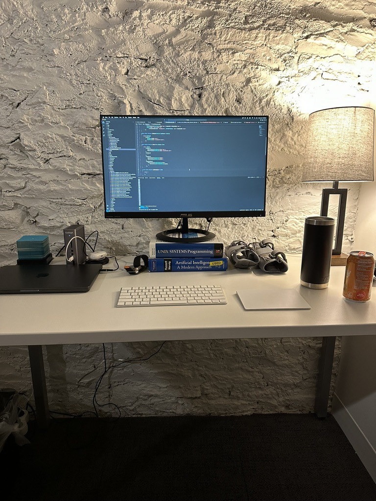

# start ups

## 👋

I often think about my sixty year-old self. What will I look back on and regret doing? Not doing? Did I sail the world? Did I really give up everything, all the momentum in my career, friendships, mortgages, and go get blasted with salt for years on end? Did I learn I get violently seasick and quit after a month? Or did I never take a big jump that I can be proud of?

For the first time, I'm confident at this moment 60 year old me is proudly looking back (time, after all, is a big ball of wibbly wobbly... time-y wimey... stuff). I quit my job! A job I had a lot of love for, with people that were incredible, that made money I was quite proud of. Why did I do it? Mostly manic anxiety about not living up to my potential, but also because I knew I needed to take that big jump in my life before it was too late. Something to hang my hat on once my knees finally gave out and my hairline ran away.

Even more concerning to some people, I did so with no idea about what I wanted to build, no revenue, and no customers. Exciting, isn't it? I think so too.

I kind of hate the current hustle culture of audience building, twitter slams, and whatnot, but I do still love writing. I've always enjoyed being able to express myself in a format outside of my head, so this isn't my attempt at building a substack that pulls in $5/mo, but to document my attempts at building something I love, and sharing some of the cool learnings along the way. Grammar be damned, I'll at least get some thoughts out there.

To begin, I've leased a 60 ft2 (5 1/2 m2) windowless co-working space to trap myself in 8 hours a day and try some cool shit. See ya soon.
