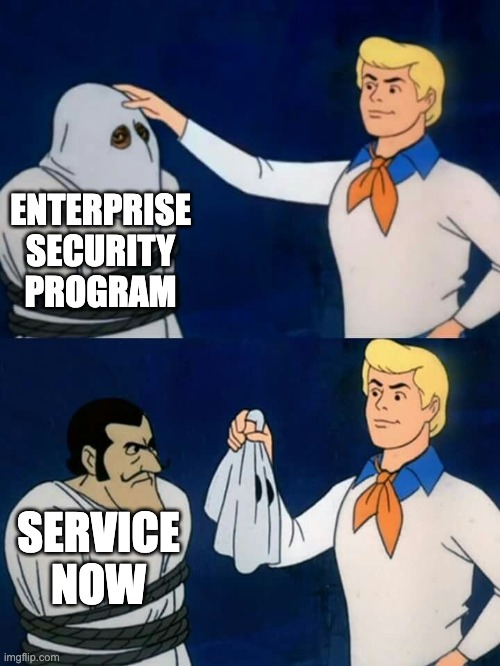

# 🐞 Vulnerability Management

In the spirit of identifying an idea with a viable [Business Model](../business-model/), marketplaces are a great idea. They offer you an already gathered set of customers, some well defined boundaries, and a reputable platform to build on top of. That's why App Stores are such a hit, they help you stand out from the breadth of garbage on the broader internet.

In my previous role, I lead a vulnerability management product, a space that someday I'll write far too much about. A common issue in the market was no matter what vulnerability management tool they used, it all went to Jira or ServiceNow. Why do these companies have such a chokehold on companies? After abandoning my [cloud security](../cloud-security/) research, I tried to find something that could build off of my experience, while not violating my non-compete. I figured we'll cross that bridge when we get there if the idea actually pans out.

## Atlassian Forge

Atlassian has a surprisingly fantastic framework for building marketplace apps called [Forge](https://developer.atlassian.com/platform/forge/getting-started/). They run all the infrastructure, handle all billing and licensing, and charge you next to nothing ([likely to change next year](https://developer.atlassian.com/platform/marketplace/pricing-payment-and-billing/#how-does-revenue-sharing-work-for-paid-via-atlassian-apps-)). That fits very well with a bootstrapped model, removes a ton of overhead from me, and lets me focus on building and selling something meaningful. I'm still super interested in this space and might pursue an idea here.

Looking across the marketplace I don't see anything for vulnerability management but do see other security tools with good traction, so it seems like a good fit. Let's gauge the market.

## Ruh roh

So here we go again, Sales Navigator and cold outreach. I sent out probably 200 LinkedIn connection invites and talked to ~10 Vulnerability Management leads at large companies that I knew would have budget for security tooling. Every. fucking. single. one. of. them. uses Service Now (SNOW). Not a single one uses Jira for vuln management. There's a wall bridging security and development, and it appears security is behind the iron curtain of SNOW. I've worked with SNOW in the past and have no interest in building an entire company around it. Luckily, again, instead of building an app on Forge for 3 months and not selling it at all, I felt confident enough to disqualify this idea. Like everything, I know there are people out there that use Jira for vulnerability management and pen testing and would benefit from this, but you've got to read the tea leaves for what they are at that point.

I'm sure I'll be back though, the market opportunity for bootstrapped businesses on Forge is huge, for now it's on to the next thing though.
